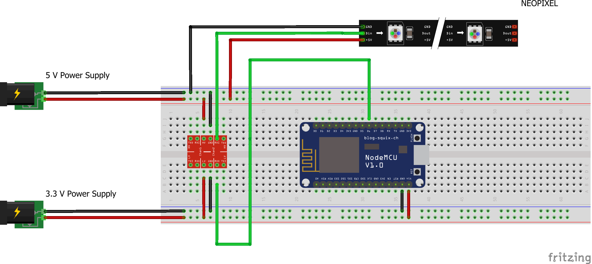

# NeoPixelWebServer #

* Connecting a Neopixel stripe (W2812b) to a ESP-8266 (NodeMCU)
* https://www.youtube.com/watch?v=6U4JssgWjr8

## setNeoColor(String) ###
Sets the whole Neopixel stripe to the specified RGB-color.
The parameter is a hexadecimal string with the format #rrggbb

